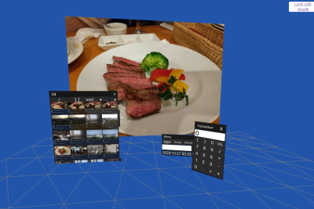

# WebVR Workspace

WebVR/WebXRで色々試すための環境です．

## Demo

https://binzume.github.io/vr-workspace/

OculusQuest等で上記URLにアクセスして `VR` ボタンをクリックしてください．

- コントローラのトリガーボタンがクリック，グリップボタンがメニュー表示とジェスチャー入力です
- ウインドウ等のドラッグ中にグリップボタンを押すと対象との距離を操作できます
- Google Drive上のファイルを使いたい場合は事前に 'Storage Settings' 内でアクセスを許可してください

サーバ等は不要ですが，別の環境で動かしたい場合は Google API の clientId等は書き換えてください．

## Features

- Physics
- Hand tracking
- VR app dynamic loading 

## Available apps

- Calculator
- Notepad
- Console
- Paint3D
- Media Player
- Storage
  - Google Drive client
  - WebkitFileSystem
  - Demo storage (Read Only)
- VNC Client (needs websockify)
- VRM model viewer

## License

MIT License
